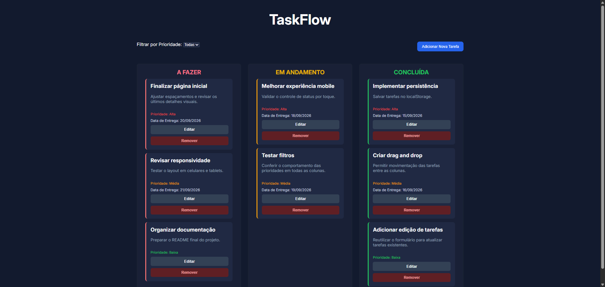
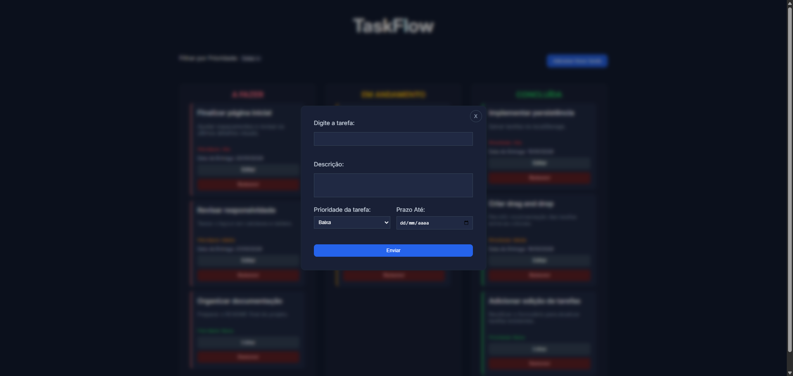
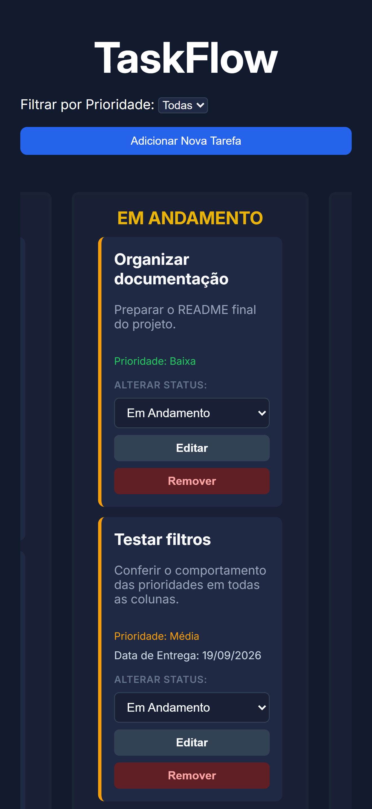

# TaskFlow

TaskFlow é uma aplicação de gerenciamento de tarefas no estilo Kanban, desenvolvida com JavaScript Vanilla.

O projeto permite criar, editar, excluir, filtrar e mover tarefas entre diferentes status, com persistência de dados no navegador.

## Demo

[Acessar o TaskFlow](https://italomartinsg.github.io/taskflow/)

## Funcionalidades

- Criação de tarefas
- Edição de tarefas
- Exclusão de tarefas
- Definição de prioridade:
  - Baixa
  - Média
  - Alta
- Definição de prazo
- Validação de título obrigatório
- Validação de data de entrega
- Organização por status:
  - A fazer
  - Em andamento
  - Concluída
- Drag and Drop entre colunas no desktop
- Controle de status alternativo no mobile
- Filtro por prioridade
- Persistência com localStorage
- Estados vazios para colunas sem tarefas
- Modal para criação e edição
- Layout responsivo
- Interface adaptada para dispositivos móveis

## Tecnologias

- HTML5
- CSS3
- JavaScript Vanilla
- LocalStorage
- HTML Drag and Drop API
- Git
- GitHub
- GitHub Pages

## Como funciona

Cada tarefa possui:

- título
- descrição
- prioridade
- prazo
- status

As tarefas são armazenadas em um array que funciona como fonte principal de dados da aplicação.

Sempre que uma alteração acontece, como criação, edição, exclusão ou mudança de status, os dados são atualizados no `localStorage` e a interface é renderizada novamente.

No desktop, as tarefas podem ser movimentadas entre as colunas utilizando Drag and Drop.

Em dispositivos móveis, a mudança de status pode ser feita através de um seletor dentro de cada card.

## Persistência de dados

O projeto utiliza `localStorage` para manter as tarefas salvas mesmo após atualizar ou fechar a página.

Os dados são convertidos para JSON antes de serem armazenados e convertidos novamente para objetos JavaScript quando a aplicação é carregada.

## Responsividade

No desktop, o TaskFlow utiliza três colunas lado a lado.

Em telas menores, o quadro mantém o formato Kanban com navegação horizontal entre as colunas.

Também foi criada uma alternativa ao Drag and Drop para dispositivos touch, permitindo alterar o status através de um `select`.

## Screenshots

### Desktop



### Modal



### Mobile

<p align="center">
  
</p>

## Estrutura do projeto

```text
taskflow/
├── assets/
├── css/
│   └── style.css
├── js/
│   └── main.js
├── index.html
└── README.md
```

## Principais aprendizados

Durante o desenvolvimento deste projeto, foram praticados conceitos como:

- manipulação do DOM
- gerenciamento de estado com arrays
- CRUD
- eventos
- delegação de eventos
- Drag and Drop
- localStorage
- filtros
- validação de formulários
- responsividade
- criação dinâmica de elementos
- organização e refatoração de funções
- separação de responsabilidades
- tratamento de estados da interface
- versionamento com Git e GitHub

## Desenvolvimento

O projeto foi desenvolvido como parte da minha evolução prática em JavaScript Vanilla, com foco em consolidar fundamentos antes de avançar para frameworks como React.

Durante o desenvolvimento, as funcionalidades foram implementadas progressivamente e versionadas em branches separadas utilizando Git e GitHub.+

## Autor

Desenvolvido por **Ítalo Martins**.

[GitHub](https://github.com/italomartinsg)
